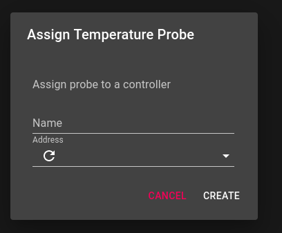

# Elsinore Web UI

WARNING: I have not run this through a full brew day at this point.

This is the (basic) companion interface to the [Elsinore](https://github.com/DougEdey/elsinore/) Backend.

Right now it supports Temperature Controllers (PID, and Manual mode), and basic Brewery settings, such as the name of the brewery

## Tools/Frameworks

It's written in [React](https://reactjs.org/) and [Next.js](https://nextjs.org/) using [Apollo GraphQL](https://www.apollographql.com/)

The Component framework is using [Material UI](material-ui.com/) just from personal preference.

## Getting started

Checkout the repository, install the dependencies, and run the server!

```bash
git clone https://github.com/DougEdey/Elsinore_Web.git
npm install
npm run dev
```

Then you can go to `http://localhost:3000` for the Web UI by default.

The server assumes you have the Elsinore server running on a host with the name `raspberrypi` (you can update this for now in [lib/apolloclient.js](./lib/apolloclient.js), it will be make configurable)

On first run, with no devices configured, you'll get an empty landing page with a button to add a new controller


To configure a controller, just select the Temperature probe in the drop down and provide a name (the refresh button will request a new list of probes from the server)



This creates the basic temperature controller with empty defaults


Clicking on the buttons below the status will show the appropriate tab for settings

* Overview


As you enable the Heating, Cooling, and Manual checkboxes the buttons in the list will be enabled for use

 

The heating/cooling settings are both "PID" settngs, so they look the same


And Manual settings (for now) use the heat GPIO as a shared setting, so switching one updates the other


Hitting save will update the server and as long as you have configured a mode in the main page, the output will run!


And that's the basics of running things.

Of course, if you want to delete a device, just click the trashcan icon on the right of the bar, and you'll get a warning prompt


You can customize the name of the brewery right now, and that's about it, double click on the brewery name to see the edit dialog


There is a light theme available (it's the default)


And the side bar has quick links to GitHub, Reddit, and Discourse


## Todo list

* [ ] Configurable Backend server
* [ ] Switch support
* [ ] Timer Support
* [ ] Proper error support (Elsinore returns 422s on errors and Apollo does not handle this well)
* [x] Tests (Kinda, I have some)
* [ ] UX care
* [ ] Lost more I can't think of
